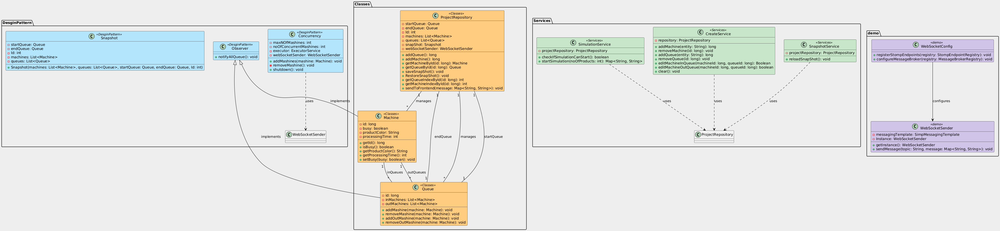

# Producer Consumer

Producer Consumer is a fullstack web application that applying Producer-Consumer Design Pattern with Threads. The Application consists of Machines and Queues that the user can build any system he wants and run to see the simulation of the process over time.

This is Our Fifth Assignment in Design Patterns Course (CSED27 Alexandria University)

## Technologies Used

- **Frontend**: React , Konva
- **Backend**: Spring Boot
- **Real-Time Communication**: WebSocket

## Design Patterns Used

1. **Singleton Pattern**:  The Singleton pattern prevents the existence of multiple objects in memory of objects that must only be created once in the system like projectRepository
2. **Observer Pattern:** The Observer pattern allows queues to automatically be notified when a machine’s state changes, ensuring real-time updates without direct interaction.
3. **Concurrency Pattern**: The Concurrency pattern ensures that multiple machines can process tasks simultaneously without causing data inconsistencies. It enhances the system’s efficiency by allowing parallel task execution.
4. **SnapShot Pattern**: The Snapshot pattern saves the system’s state at a start point, allowing it to be restored on restart.

## UML

### **UML Diagram:** 

## [Demo](#demo)
https://github.com/user-attachments/assets/25ea2b97-3b50-44f5-a0d6-019b39ddb60b

## Project Report

### For more detalied information check [Project Report](https://github.com/abdonaware/Producer-Consumer-Simulation/blob/main/assets/Producer%20Consumer.pdf)
